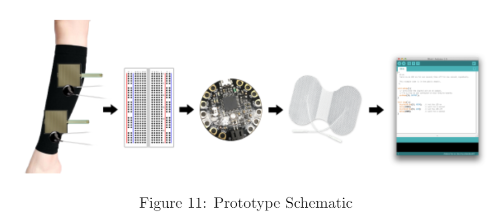
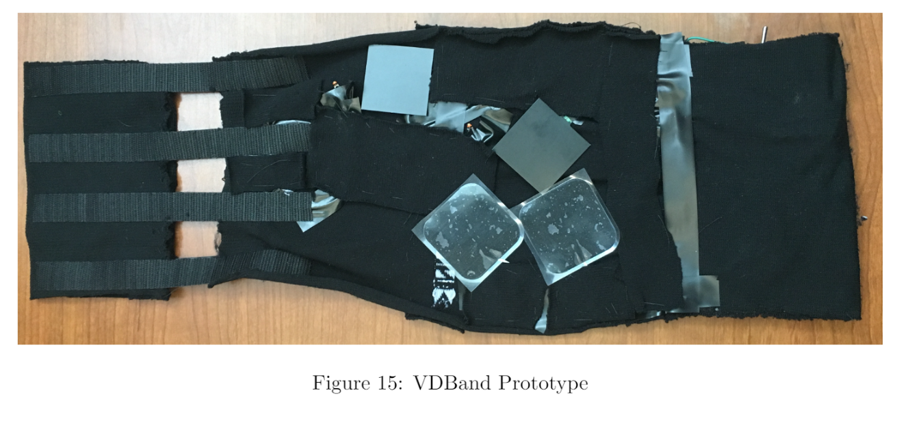

# VDBand
- Designed and created a medical compression sock with neuro-muscular electrical stimulation for patients with circulatory problems
- Utilized knowledge of sensors, micro-controllers and circuitry design to implement inside the compression sock

